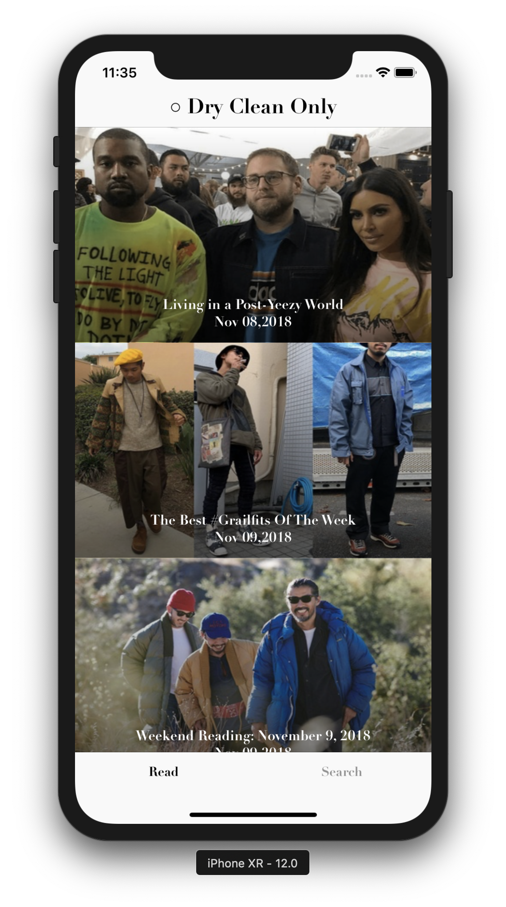

# Grailed Challenge

## Intro:
Hello! Thank you all for this opportunity and taking the time to consider me as a candidate for Grailed! The link to the GitHub repository is: https://github.com/antochan/Grailed-Challenge. 

## Part I: Article API 

Task: Display a list of articles showing image, title, and publish date with Grailed API. 
Files: `ArticlesViewController`, `Article` (model), `ArticleTableViewCell` (with XIB), `ArticleServices`, `Article.storyboard`

•	ArticleServices is used to make the network request to the API endpoint. (getArticle function) 

•	Article has it’s own storyboard with embedded `navigation bar`, `tab bar` and `tableview`. 

•	Each cell has its own xib file with a `CustomImageView`, and a UILabel. 

•	`CustomImageView` has caching and function `loadImageUsingUrlString` to fetch display image via url. 

•	Pagination feature works by passing in a page number to the request endpoint and appending new data into the array of articles. 

Note: In terms of UI I took reference from the main existing Grailed app. 

## Part II: Saved Search API 

Task: Display a list of saved searches showing image and name with Grailed API. 
Files: SavedSearchViewController, Product (model), ProductCollectionViewCell (with XIB), Product, SavedSearch.storyboard

•	SavedSearchServices is used to make the network request to the API endpoint. (getProducts function) 

•	SavedSearch has it’s own storyboard with embedded navigation bar, tab bar and collectionview. 

•	Each cell has its own xib file with a `CustomImageView`, and a UILabel.

Note: I decided to use collectionview to emulate a shopping experience for a user’s saved searches. 

## Miscellaneous 
•	I added one 3rd party library called Lottie which displays animations. I mainly used this to indicate loading / disabling user interaction on the screen when loading from a network request. This is the `displaySpinner` and `removeSpinner` function that can be found in Constants.swift 

•	I added a function called `addBlackGradientLayer` in `ImageUtilities.swift` so the article image can have a gradient effect on it. 

•	I added a few test cases on some utility functions in the file `UtilitiesTest.swift`. 

## Quick Notes

I.	API requests were done through URL session and parsing done through Decodable
II.	Architecture: Mainly follows MVC 
III.	Design pattern: I chose to use a singleton pattern because of the simplicity of the app and quicker implementation (If more time I’d include dependency injection) 
IV.	Tests: Unit test was done through built in XCTest feature 
V.	3rd Party Framework: Just one, Lottie for animation 

## Conclusion
If there was anything in my submission that you’d like to see me add on or if I misinterpreted any of the technical requirements please let me know, I’d be happy to add on or discuss further! In addition, if there are some architecture/design patterns you would like to see me use instead of my current submission please let me know as well! Finally, if there are any questions or problems regarding my submission feel free to contact me at 470-240-7328 or antonio.chan@emory.edu.

